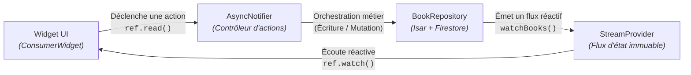
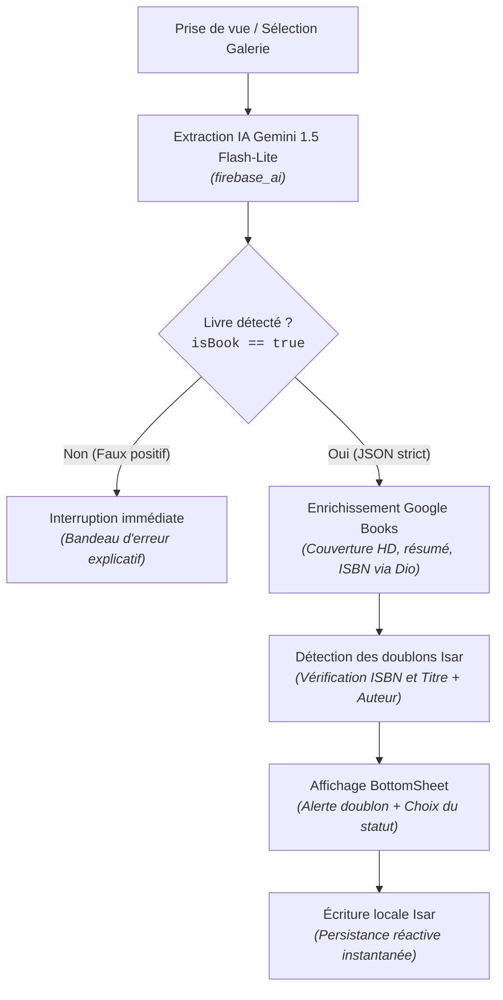

# Architecture logicielle (Kitob)

Ce document détaille les choix d'ingénierie logicielle, les flux de données et l'implémentation de la stratégie *offline-first* au sein de l'application **Kitob**.

---

## 1. Principes directeurs

Le développement de Kitob repose sur trois piliers architecturaux majeurs :

* **Offline-first absolu :** l'application ne dépend d'aucun appel réseau pour son fonctionnement nominal de catalogage, de consultation et de recherche. La base de données locale **Isar** constitue la source unique de vérité (*Single Source of Truth*).
* **Séparation stricte des responsabilités (*Layered Architecture*) :** le code est scindé en couches étanches. Les composants graphiques ne contiennent aucune logique métier ni accès direct aux moteurs de persistance.
* **Gestion d'état réactive et immuable (Riverpod 2.x) :** l'interface utilisateur reflète passivement des flux de données typés (`AsyncValue<T>`). Les mutations d'état s'opèrent par le remplacement d'instances immuables (`copyWith`).

---

## 2. Découpage en couches

Le code source est organisé selon une hiérarchie modulaire stricte :

```text
lib/
├── constants/          # Constantes immuables, tokens graphiques et endpoints
├── models/             # Entités de domaine et schémas Isar (@collection)
├── services/           # Accès techniques bruts aux APIs et périphériques
├── repositories/       # Abstraction et coordination des sources de données
├── providers/          # Notifiers et contrôleurs de gestion d'état Riverpod 2
├── router/             # Définition des routes déclaratives avec GoRouter
├── screens/            # Vues complètes (Home, Scan, Detail, Profile)
└── widgets/            # Composants graphiques atomiques et réutilisables
```

### Rôle et responsabilités de chaque niveau :

| **Couche**              | **Rôle principal**                                                                                                                                                         | **Dépendances autorisées**               |
|-------------------------|----------------------------------------------------------------------------------------------------------------------------------------------------------------------------|------------------------------------------|
| `models/`               | Définit la structure des données métier (`Book`, `ReadingStatus`).                                                                                                          | Annotations Isar uniquement.             |
| `services/`             | Interfaces bas niveau avec les SDKs externes : lecture/écriture Isar, requêtes HTTP Dio (Google Books), inférence multimodale (Firebase AI) et sessions Firebase Auth.     | Bibliothèques externes dédiées.          |
| `repositories/`         | Orchestre les opérations métier. Il coordonne Isar et Cloud Firestore pour garantir la cohérence des écritures et des suppressions.                                        | `models/`, `services/`.                  |
| `providers/`            | Expose les états consommables par l'interface sous forme de `StreamProvider`, `Notifier` et `AsyncNotifier`.                                                                 | `repositories/`, `services/`, `models/`. |
| `screens/` & `widgets/` | Rendu graphique passif (`ConsumerWidget`). Déclenche des actions via `ref.read` et observe l'état via `ref.watch`.                                                         | `providers/`, `constants/`, `models/`.   |

## 3. Gestion d'état avec Riverpod 2.x

L'application respecte les conventions modernes de Riverpod 2 en excluant les anciens `StateNotifier` ou `ChangeNotifier`.



### Principaux Providers du système :

- `booksStreamProvider` (`StreamProvider.autoDispose`) : écoute en continu les mutations de la table locale Isar et réémet la liste des livres filtrée dès qu'un critère (statut ou texte recherché) évolue.
- `bookFilterProvider` (`Notifier<BookFilterState>`) : stocke les filtres d'affichage actifs (statut sélectionné et chaîne de recherche).
- `bookStreamProvider(id)` (`StreamProvider.autoDispose.family`) : instancie un flux réactif ciblé sur un seul identifiant d'ouvrage pour alimenter la fiche détail.
- `scanProvider` (`NotifierProvider.autoDispose<ScanNotifier, ScanState>`) : gère la machine à états finis du tunnel de capture (`capturing` $\rightarrow$ `analyzingImage` $\rightarrow$ `enrichingMetadata` $\rightarrow$ `checkingDuplicates` $\rightarrow$ `completed`).
-`authActionProvider` / `syncActionProvider` (`AsyncNotifierProvider`) : coordonnent les mutations asynchrones du compte utilisateur et la synchronisation avec verrouillage d'interface (`AsyncLoading`).

## 4. Stratégie Offline-First & Synchronisation Cloud

La synchronisation ne remplace jamais la base locale : elle s'exécute en tâche de fond pour réconcilier l'état local et la collection distante Firestore (`users/{userId}/books/{bookId}`).

### A. Cycle de persistance locale

Toute création ou modification est immédiatement inscrite dans Isar avec le flag `isSynced = false`. L'interface réagit en moins d'une milliseconde via le flux Isar sans attendre de confirmation réseau.

### B. Protocole de synchronisation bidirectionnelle (`FirestoreSyncService`)

1. **Phase montante (_Push_) :**
  - Récupération de tous les livres locaux où `isSynced == false`.
  - Attribution d'un `remoteId` (identifiant unique de document Firestore) si l'ouvrage est nouveau.
  - Écriture par lot (_upsert_) sur Firestore.
  - Marquage local `isSynced = true` dans une transaction Isar.

2. **Phase descendante (_Pull_) :**
  - Lecture de la sous-collection Firestore rattachée au compte connecté.
  - Pour chaque document distant :
    - S'il n'existe pas localement, insertion dans Isar.
    - S'il existe localement, comparaison des horodatages `updatedAt` : la version la plus récente prévaut (**stratégie _Last-Write-Wins_**).

### C. Gestion d'identité et transition sans perte

- **Démarrage transparent :** dès la première ouverture, l'application génère un compte anonyme Firebase Auth. Les livres sont déjà synchronisables sur un espace distant réservé à cet UID.
- **Association (Account Linking) :** lorsque l'utilisateur renseigne un email et un mot de passe, `linkWithCredential` convertit le compte sans modifier l'UID d'origine : aucun livre n'est dupliqué ni perdu.
- **Isolation à la déconnexion :** lors de l'appel à `signOut()`, la table locale Isar est vidée intégralement afin d'éviter toute fuite de données privées sur un appareil partagé.

## 5. Pipeline multimodal de numérisation

Le traitement d'une image suit une chaîne d'enrichissement séquentielle optimisée :



- **Sorties forcées en JSON strict (_Structured Outputs_) :** l'appel à Gemini Vision injecte un `responseSchema` strict garantissant la réception directe des clés `{isBook, title, author, volumeNumber}` sans passer par une analyse de texte floue.
- **Tolérance aux pannes :** si Google Books ne retourne aucun résultat pour un livre ancien ou rare, l'application exploite directement les données extraites par Gemini et conserve la photo prise localement comme couverture de référence.